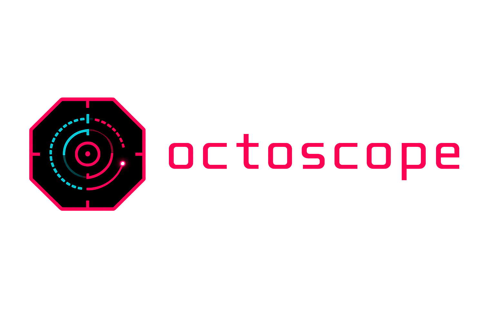
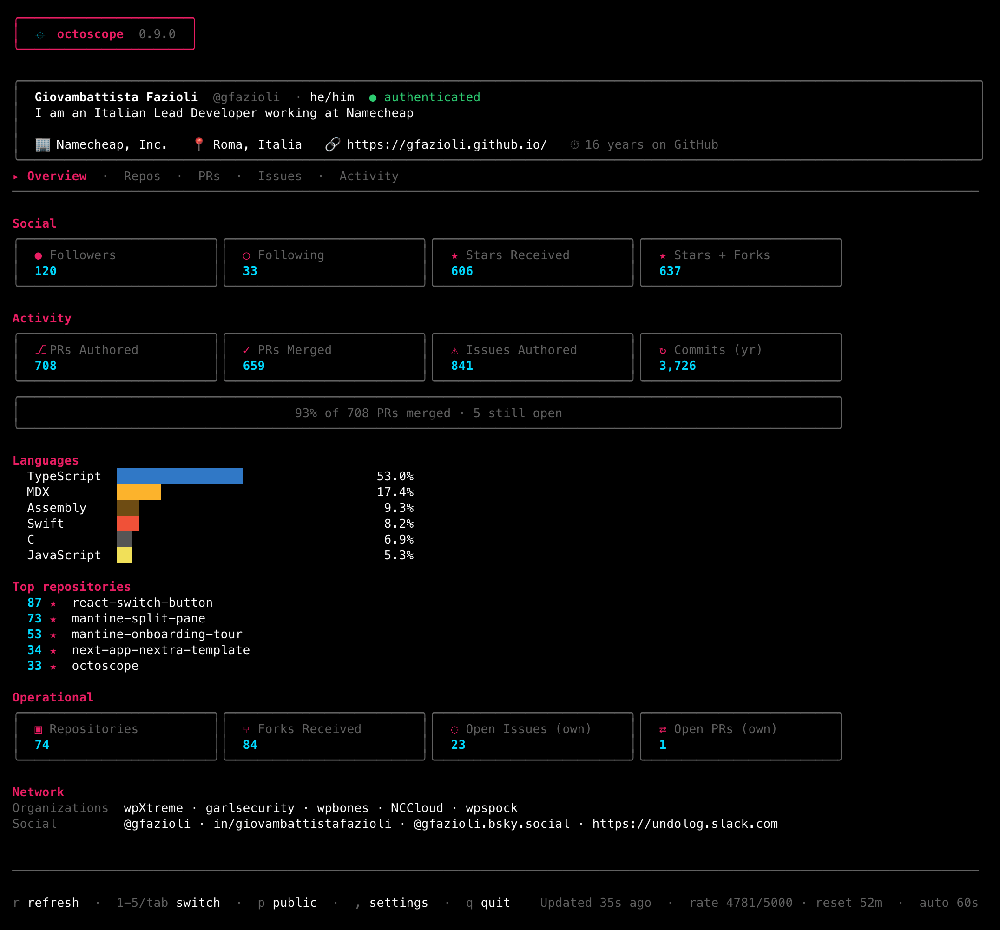
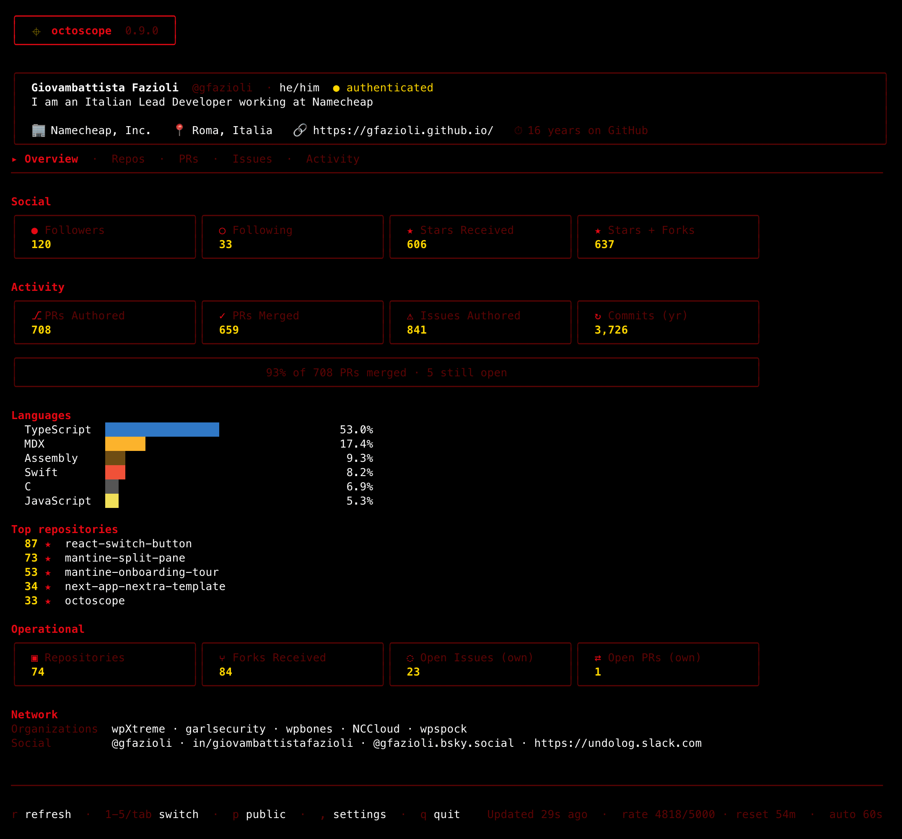
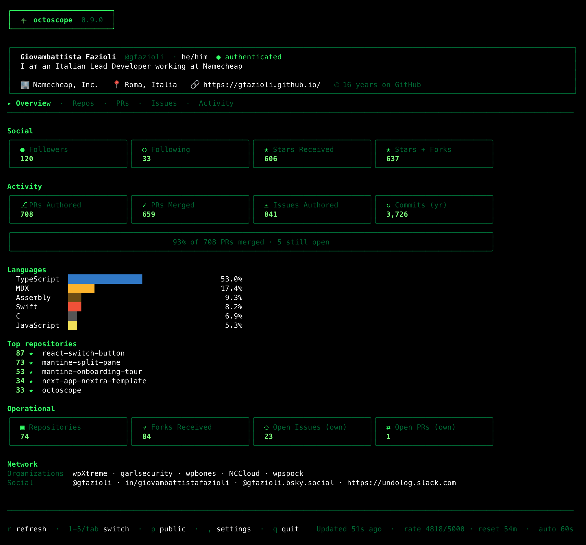
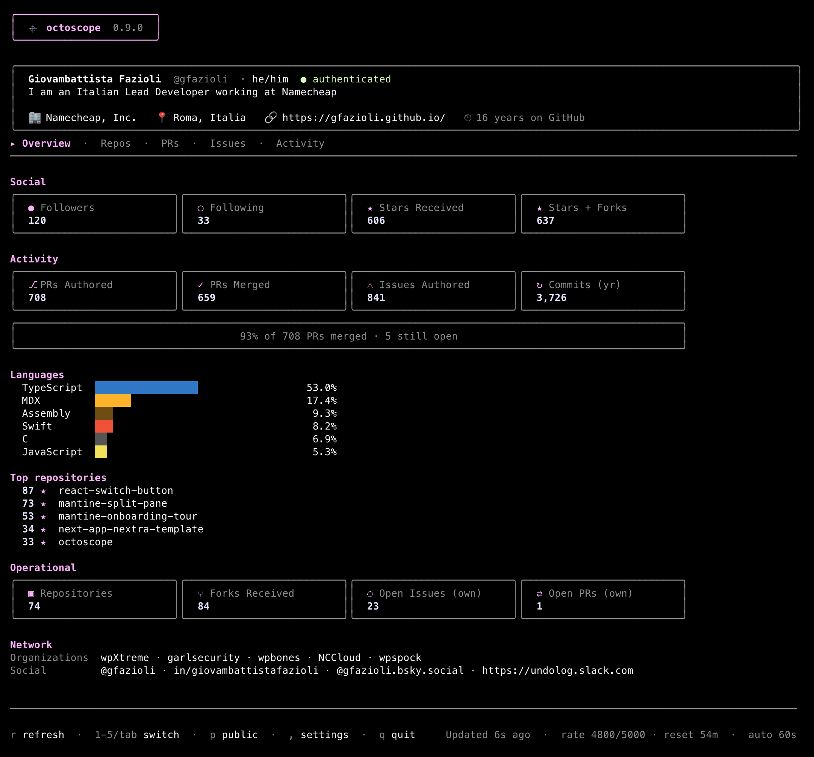

<div align="center">

  
  
<br/>octoscope
<h1>↓</h1>

A terminal dashboard for **your GitHub account, or anyone else's public
profile** — profile, activity, repo health and network at a glance,
auto-refreshed in the background.


[](https://github.com/gfazioli/octoscope/releases/latest)


<h1>↓</h1>

  
</div>

## Contents

- [What it does](#what-it-does)
  - [The tabs](#the-tabs)
  - [Rate-limit awareness](#rate-limit-awareness)
  - [Public-only mode](#public-only-mode)
  - [Activity tab](#activity-tab)
  - [Live feedback](#live-feedback)
  - [What octoscope can't show](#what-octoscope-cant-show)
- [Install](#install)
  - [Homebrew (macOS & Linux)](#homebrew-macos--linux)
  - [From source](#from-source)
  - [Pre-built binary](#pre-built-binary)
- [Usage](#usage)
- [Themes](#themes)
- [Configuration](#configuration)
  - [In-app settings panel](#in-app-settings-panel)
- [Authentication](#authentication)
  - [Token scopes](#token-scopes)
- [Contributing](#contributing)
- [Sponsor](#sponsor)
- [License](#license)

## What it does

octoscope is a single-binary TUI built with
[BubbleTea](https://github.com/charmbracelet/bubbletea). It pulls a focused
set of numbers from the GitHub GraphQL API in one round-trip and keeps them
current on screen so you can check the pulse of your GitHub life without
switching to a browser.

The dashboard is split into **tabs** (`Overview`, `Repos`, `PRs`, `Issues`,
`Activity`) — jump with number keys or cycle with `tab` / `shift+tab`.

### The tabs

- **Overview** — the five stat sections below, the traditional dashboard
  landing.
- **Repos** — every owned, non-fork repository in one sortable, searchable
  list. Columns: name, primary language, stars, forks, open issues, open
  PRs, last push. Press `s` to cycle sort, `/` to filter by substring, the
  viewport scrolls so even a 100-repo account stays navigable.
- **PRs** — every open pull request you've authored, across every repo.
  Number, title, repo, state (draft / ready / conflicts) and last-update
  time. Same sort & search idioms as Repos.
- **Issues** — every open issue you've authored, wherever it lives. Same
  shape as PRs minus the state column.
- **Activity** — 52-week contribution heatmap, plus total / current streak /
  longest streak / busiest day computed from the same cells.

The **Overview** tab is organised in five sections:

- **Profile** — name, login, pronouns, bio, company, location, website, and
  how many years you've been on GitHub
- **Social** — Followers · Following · Stars received (across your non-fork
  repositories) · plus a 4th *Stars + Forks* card when you own forks that
  carry stargazers, so the dashboard reconciles with counters that don't
  filter forks out
- **Activity** — lifetime PRs authored and merged, lifetime issues authored,
  and commits in the last 12 months, with a takeaway line ("X% of N PRs
  merged · M still open") summarising the funnel; underneath, a Languages
  bar (byte counts across your owned repos, colour-matched to GitHub's own
  hex palette) and a *Top repositories* column ranking your five most-starred
  owned non-fork repos
- **Operational** — repositories, forks received, open issues *(own)* and
  open PRs *(own)* across your owned repositories — the *(own)* qualifier
  disambiguates from your lifetime authored counts above
- **Network** — the organisations you're a member of plus your verified
  social accounts (X, LinkedIn, Bluesky, Mastodon…)

The top header also shows whether the current session is authenticated and
how fresh the data is. Auto-refresh runs every 60 seconds; press `r` at any
time for an on-demand refresh.

### Rate-limit awareness

The footer surfaces your GitHub GraphQL budget live:

```
Updated 12s ago  ·  rate 4872/5000  ·  reset 23m  ·  auto 60s
```

The chip is muted at normal levels, warn-yellow under 20% remaining, and
error-red under 5%. If GitHub ever tells us we're out of budget, the
auto-refresh backs off until the reset time instead of hammering every
60s.

When a refresh fails, the footer says **why** — `rate-limited · retry at
14:23`, `token rejected · check $GITHUB_TOKEN`, `offline · retrying`, or
`github errored · retrying` — so you know whether to wait, fix auth, or
check the network.

### Public-only mode

Pass `--public-only` to hide private repositories, PRs and issues from
the lists — perfect for demos, screenshots and screencasts where you
don't want internal work leaking. Global counters (PRs Authored, PRs
Merged, Issues Authored) stay complete; only titles and repo names get
filtered.

### Activity tab

The **Activity** tab renders the last ~52 weeks of your public contribution
calendar as a heatmap, shaded on an accent-pink gradient that adapts to
your own distribution (the busiest day always hits the full neon pink, the
quiet days sit on the surface grey). Underneath:

- **Total contributions** for the window
- **Current streak** (how many consecutive days you've pushed)
- **Longest streak** in the window
- **Busiest day** with its date, so you know when you shipped the most

### Live feedback

- **Change pulse** — whenever a value changes between two refreshes (e.g. a
  new star arrives, someone follows or unfollows you, an issue gets closed),
  the affected card's border flashes accent-pink for 2 seconds.
- **Native notifications** — Stars and Followers changes also trigger a
  system notification and a short audio beep, so you notice the "passive"
  events even when octoscope is in a background tab. Clicking the banner
  opens the relevant page (your profile for follower changes, the
  starred-repos tab for star changes).
  - **macOS**: notifications go through `terminal-notifier`, which the
    Homebrew formula installs automatically as a dependency. If you
    installed octoscope another way (`go install`, manual binary), run
    `brew install terminal-notifier` once. The click-through works;
    the **custom icon does not** — Apple deprecated `NSUserNotification`
    in macOS 11, and the system now ignores `-appIcon` overrides for
    notifications coming from CLI tools. The banner shows the
    `terminal-notifier` icon instead. Cosmetic only.
  - **Linux & Windows**: notifications carry the embedded octoscope
    icon. Click activation depends on your DE / shell — best-effort.

### What octoscope can't show

Some things you can see on your GitHub profile page are **not exposed** by
the GitHub GraphQL or REST API, so octoscope doesn't show them:

- **Achievements** (Pull Shark, Starstruck, YOLO, …)
- **Highlights** like the PRO badge
- The **local time** next to the location field

Supporting any of these would require scraping the profile HTML, which we
don't do.

## Install

### Homebrew (macOS & Linux)

```bash
brew install gfazioli/tap/octoscope
```

`brew upgrade gfazioli/tap/octoscope` picks up newer versions as they
ship.

### From source

```bash
go install github.com/gfazioli/octoscope@latest
```

Requires Go 1.25 or later.

### Pre-built binary

Download the right platform archive from the
[latest GitHub Release](https://github.com/gfazioli/octoscope/releases/latest),
unpack it, and drop the `octoscope` binary anywhere on your `$PATH`.

## Usage

```bash
octoscope                       # your dashboard (requires a token)
octoscope <username>            # any public profile (token optional)
octoscope --refresh 30s         # auto-refresh every 30 seconds
octoscope --compact             # dense card layout for narrow terminals
octoscope --public-only         # hide private repos/PRs/issues (safe for demos)
octoscope --theme phosphor      # 80s green CRT theme — see Themes section
```

Examples:

```bash
octoscope                # you
octoscope torvalds       # Linus Torvalds
octoscope gvanrossum     # Guido van Rossum
octoscope gfazioli       # the author
octoscope --public-only  # you, but screenshot-safe
```

## Themes

octoscope ships with **seven built-in themes**. Pick one with
`--theme NAME`, the `theme` config key, or cycle through them live
in the in-app settings panel (`,` → arrow down to *Theme* → `←` /
`→`).

| Theme | Vibe |
|-------|------|
| `octoscope` | Default — pink + cyan |
| `high-contrast` | Pure white accent, ANSI brights — maximum legibility |
| `terminal` | Inherits from your emulator's palette (ANSI 8-15) |
| `monochrome` | All-greys, zero chroma |
| `stranger-things` | Crimson + Christmas-lights yellow on an "Upside Down" muted |
| `phosphor` | 80s P1/P31 CRT pure green — vt100 vibe |
| `amber` | 80s amber CRT (IBM 5151, WordStar) |

Three of them, side by side:

| `stranger-things` | `phosphor` | `terminal` |
|---|---|---|
|  |  |  |

The `terminal` theme is special: it picks colours from the **ANSI
brights of your emulator's palette**, so it follows your iTerm /
Ghostty / Alacritty colour scheme automatically. The screenshot
above is what `terminal` looks like with the author's iTerm palette
— yours will differ.

You can override just the accent colour while keeping the rest of a
theme via the `accent_color` config key (or `--theme` plus an
`accent_color` in the file). Any value lipgloss accepts works: hex
like `"#FF0080"` or ANSI 256 numbers like `"201"`.

## Configuration

octoscope reads `~/.config/octoscope/config.toml` on startup (honours
`$XDG_CONFIG_HOME` when set). All keys are optional; missing keys fall
back to defaults. CLI flags override the file. The file is **not**
created automatically — write it yourself when you want to customise.

```toml
# ~/.config/octoscope/config.toml

# Auto-refresh interval. Go duration syntax: "30s", "1m", "5m", "1h".
refresh_interval = "1m"

# Hide private repositories, PRs and issues from the list tabs.
# Useful if you screenshot or screencast octoscope often. Global
# counters (PRs Authored, Issues Authored, ...) stay complete since
# they're aggregate numbers, not titles.
public_only = false

# Use the dense card layout in the Overview tab — smaller cards,
# abbreviated labels. Fits more onto narrow terminals.
compact = false

# Visual theme. Built-in: octoscope (default), high-contrast,
# terminal, monochrome, stranger-things, phosphor, amber.
theme = "octoscope"

# Optional override for just the accent slot of the active theme.
# Hex ("#FF0080") or ANSI 256 ("201"). Leave unset to keep the
# theme's default accent.
# accent_color = "#FF0080"
```

Pass `--config PATH` to read a different file (handy for trying out
configs without touching the default one).

A malformed TOML file makes octoscope exit with an error so you
notice the typo straight away — there's no silent fallback to
defaults when the file is present but broken.

### In-app settings panel

You don't have to drop to a shell to tweak settings: press `,`
(comma) while octoscope is running and a settings panel opens.
Use `↑` / `↓` (or `Tab`) to move between rows, `space` to flip a
toggle, `←` / `→` to cycle the theme picker, type to edit the
refresh field, `Enter` to save, `Esc` to cancel.

What you change applies **live and instantly**: a new
`refresh_interval` reschedules the auto-refresh tick, `compact`
re-renders, `public_only` filters the lists on the spot, and
`theme` rebuilds every style on save so the dashboard repaints in
the new palette without a restart. The panel persists changes back
to your config file (the default path or whatever you passed to
`--config`), so the next launch picks them up too.

For the most common toggle, you also get a single-key shortcut
outside the panel: hit `p` from any tab and public-only flips
state immediately, with the file updated alongside. A yellow
`◐ public-only` badge next to `authenticated` in the profile
card makes the current mode unmissable at a glance.

Key bindings while running:

| Key | Action |
|-----|--------|
| `1`-`5` | Jump to tab (Overview, Repos, PRs, Issues, Activity) |
| `tab` / `shift+tab` | Cycle tabs forward / backward |
| `↑` / `↓`, `j` / `k` | Move cursor in list tabs |
| `g` / `G` | Jump to top / bottom |
| `s` | Cycle sort column |
| `/` | Filter by substring |
| `enter` | Open the selected repo / PR / issue in your browser |
| `r` | Refresh now |
| `p` | Toggle public-only mode (saves to config) |
| `,` | Open the in-app settings panel |
| `←` / `→` | Cycle theme (when the Theme row is focused in the settings panel) |
| `q` | Quit |
| `ctrl+c` | Quit |

(Pass `--help` for the full list of CLI flags and their defaults.)

## Authentication

octoscope resolves a GitHub token from, in order:

1. `$GITHUB_TOKEN` environment variable
2. `gh auth token` — if the [GitHub CLI](https://cli.github.com) is installed and logged in
3. No token — falls back to the unauthenticated GitHub rate limit (60 req/h)

Rules of thumb:

- **Viewing your own account** (`octoscope` with no arg) requires a token — there's no "viewer" to resolve without one.
- **Viewing any other user** (`octoscope <username>`) works with or without a token, but without one the unauthenticated 60 req/h limit gets burned through fast at the default 60-second refresh interval.

A token is effectively required if you plan to keep the dashboard open for
more than a few minutes regardless of whose profile you're viewing.

### Token scopes

octoscope is **read-only** — it never mutates anything on your account.
The minimal scopes it needs depend on which kind of token you mint:

**Fine-grained personal access token** (recommended). All permissions
are read-only:

- *Repository permissions*
  - `Metadata` — Read (mandatory)
  - `Contents` — Read
  - `Issues` — Read
  - `Pull requests` — Read
- *Account permissions*
  - `Profile` — Read
  - `Followers` — Read
  - `Email addresses` — Read *(only if you want the email field on the
    profile card)*

Under *Repository access* pick **All repositories** (or just the ones
you want to see).

**Classic personal access token:**

- `read:user` — profile, followers, social accounts
- `repo` — required to see your **private** repos / PRs / issues. Drop
  it if you only care about public content; the dashboard still works
  and just hides private items.
- `read:org` — only needed if you're a member of orgs with **private**
  membership and want them under *Network*. Public org memberships
  show up without it.

**Via `gh auth token`:** if the [GitHub CLI](https://cli.github.com) is
already logged in (`gh auth login`), octoscope picks up that token
automatically — the default `gh` scopes already cover everything.

octoscope never needs `write:*`, `delete_repo`, `admin:*`, `gist`, or
any workflow scope.

## Contributing

Bug reports and ideas are welcome via
[issues](https://github.com/gfazioli/octoscope/issues). Pull requests, too —
please open an issue first for anything non-trivial so we can agree on the
shape before code lands.

## Sponsor

<div align="center">

[<kbd> <br/> ❤️ If this tool has been useful to you or your team, please consider becoming a sponsor <br/> </kbd>](https://github.com/sponsors/gfazioli?o=esc)

</div>

Your support helps me:

- Keep the project actively maintained with timely bug fixes and security updates	
- Add new features, improve performance, and refine the developer experience	
- Expand test coverage and documentation for smoother adoption	
- Ensure long-term sustainability without relying on ad hoc free time	
- Prioritize community requests and roadmap items that matter most

Open source thrives when those who benefit can give back—even a small monthly contribution makes a real difference. Sponsorships help cover maintenance time, infrastructure, and the countless invisible tasks that keep a project healthy.

Your help truly matters.

💚 [Become a sponsor](https://github.com/sponsors/gfazioli?o=esc) today and help me keep this project reliable, up-to-date, and growing for everyone.

## License

MIT — see [LICENSE](LICENSE).

---

[](https://www.star-history.com/?repos=gfazioli%2Foctoscope&type=timeline&legend=top-left)
