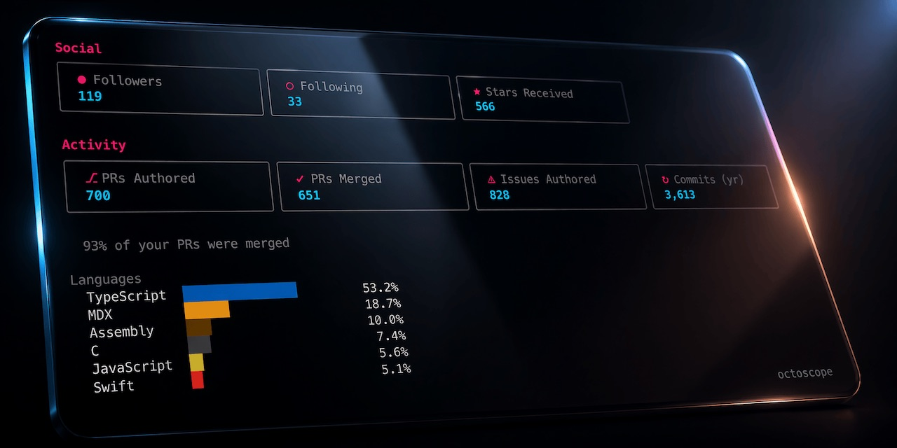

# octoscope

A terminal dashboard for **your GitHub account, or anyone else's public
profile** — profile, activity, repo health and network at a glance,
auto-refreshed in the background.

[](https://github.com/gfazioli/octoscope/releases/latest)


<p align="center">
  
</p>

## What it does

octoscope is a single-binary TUI built with
[BubbleTea](https://github.com/charmbracelet/bubbletea). It pulls a focused
set of numbers from the GitHub GraphQL API in one round-trip and keeps them
current on screen so you can check the pulse of your GitHub life without
switching to a browser.

The dashboard is split into **tabs** (`Overview`, `Repos`, `PRs`, `Issues`,
`Activity`) — jump with number keys or cycle with `tab` / `shift+tab`.
Two tabs carry content today; the other three are placeholders for the
drill-in views coming in v0.7.0.

The **Overview** tab is organised in five sections:

- **Profile** — name, login, pronouns, bio, company, location, website, and
  how many years you've been on GitHub
- **Social** — Followers · Following · Stars received across your non-fork
  repositories
- **Activity** — lifetime PRs authored and merged, lifetime issues authored,
  and commits in the last 12 months, plus a languages bar that aggregates
  byte counts across your owned repos and colours each bar with the same
  hex GitHub uses on the site
- **Operational** — public repositories, forks received, open issues and
  open PRs across your owned repositories
- **Network** — the organisations you're a member of plus your verified
  social accounts (X, LinkedIn, Bluesky, Mastodon…)

The top header also shows whether the current session is authenticated and
how fresh the data is. Auto-refresh runs every 60 seconds; press `r` at any
time for an on-demand refresh.

### Activity tab

The **Activity** tab renders the last ~52 weeks of your public contribution
calendar as a heatmap, shaded on an accent-pink gradient that adapts to
your own distribution (the busiest day always hits the full neon pink, the
quiet days sit on the surface grey). Underneath:

- **Total contributions** for the window
- **Current streak** (how many consecutive days you've pushed)
- **Longest streak** in the window
- **Busiest day** with its date, so you know when you shipped the most

### Live feedback

- **Change pulse** — whenever a value changes between two refreshes (e.g. a
  new star arrives, someone follows or unfollows you, an issue gets closed),
  the affected card's border flashes accent-pink for 2 seconds.
- **Native notifications** — Stars and Followers changes also trigger a
  system notification and a short audio beep, so you notice the "passive"
  events even when octoscope is in a background tab. macOS, Linux and
  Windows — no configuration needed.

### What octoscope can't show

Some things you can see on your GitHub profile page are **not exposed** by
the GitHub GraphQL or REST API, so octoscope doesn't show them:

- **Achievements** (Pull Shark, Starstruck, YOLO, …)
- **Highlights** like the PRO badge
- The **local time** next to the location field

Supporting any of these would require scraping the profile HTML, which we
don't do.

## Install

### Homebrew (macOS & Linux)

```bash
brew install gfazioli/tap/octoscope
```

`brew upgrade gfazioli/tap/octoscope` picks up newer versions as they
ship.

### From source

```bash
go install github.com/gfazioli/octoscope@latest
```

Requires Go 1.25 or later.

### Pre-built binary

Download the right platform archive from the
[latest GitHub Release](https://github.com/gfazioli/octoscope/releases/latest),
unpack it, and drop the `octoscope` binary anywhere on your `$PATH`.

## Usage

```bash
octoscope                # your dashboard (requires a token)
octoscope <username>     # any public profile (token optional)
```

Examples:

```bash
octoscope                # you
octoscope torvalds       # Linus Torvalds
octoscope gvanrossum     # Guido van Rossum
octoscope gfazioli       # the author
```

Key bindings while running:

| Key | Action |
|-----|--------|
| `1`-`5` | Jump to tab (Overview, Repos, PRs, Issues, Activity) |
| `tab` / `shift+tab` | Cycle tabs forward / backward |
| `r` | Refresh now |
| `q` | Quit |
| `ctrl+c` | Quit |

### Authentication

octoscope resolves a GitHub token from, in order:

1. `$GITHUB_TOKEN` environment variable
2. `gh auth token` — if the [GitHub CLI](https://cli.github.com) is installed and logged in
3. No token — falls back to the unauthenticated GitHub rate limit (60 req/h)

Rules of thumb:

- **Viewing your own account** (`octoscope` with no arg) requires a token — there's no "viewer" to resolve without one.
- **Viewing any other user** (`octoscope <username>`) works with or without a token, but without one the unauthenticated 60 req/h limit gets burned through fast at the default 60-second refresh interval.

A token is effectively required if you plan to keep the dashboard open for
more than a few minutes regardless of whose profile you're viewing.

## Contributing

Bug reports and ideas are welcome via
[issues](https://github.com/gfazioli/octoscope/issues). Pull requests, too —
please open an issue first for anything non-trivial so we can agree on the
shape before code lands.

## Sponsor

<div align="center">

[<kbd> <br/> ❤️ If this tool has been useful to you or your team, please consider becoming a sponsor <br/> </kbd>](https://github.com/sponsors/gfazioli?o=esc)

</div>

Your support helps me:

- Keep the project actively maintained with timely bug fixes and security updates	
- Add new features, improve performance, and refine the developer experience	
- Expand test coverage and documentation for smoother adoption	
- Ensure long-term sustainability without relying on ad hoc free time	
- Prioritize community requests and roadmap items that matter most

Open source thrives when those who benefit can give back—even a small monthly contribution makes a real difference. Sponsorships help cover maintenance time, infrastructure, and the countless invisible tasks that keep a project healthy.

Your help truly matters.

💚 [Become a sponsor](https://github.com/sponsors/gfazioli?o=esc) today and help me keep this project reliable, up-to-date, and growing for everyone.

## License

MIT — see [LICENSE](LICENSE).

---

[](https://www.star-history.com/#gfazioli/octoscope&Timeline)
